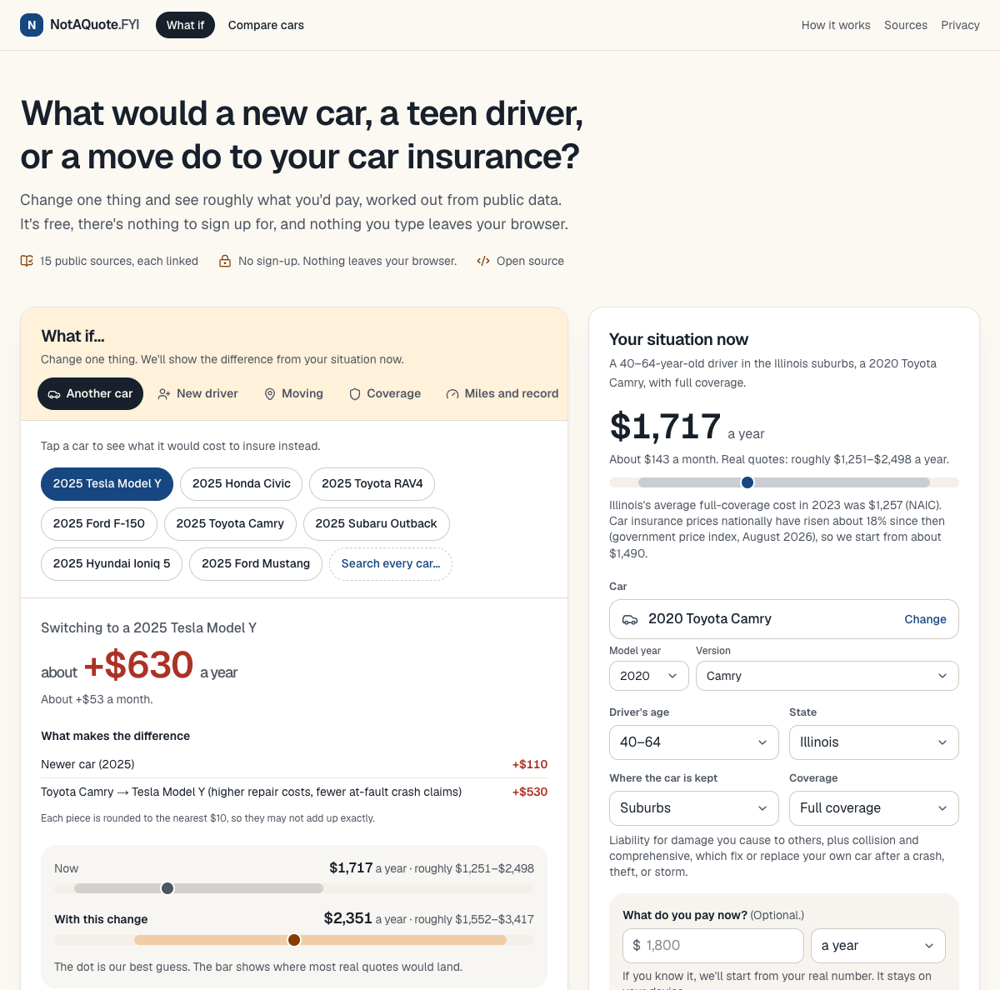
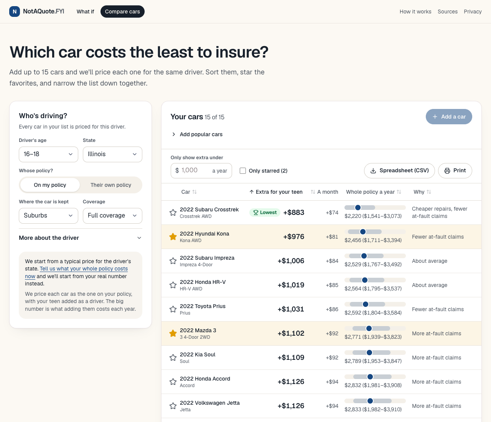

# NotAQuote.FYI

A free, open-source way to see what a new car, a teen driver, or a move would do to your car insurance. It answers questions like *"What happens to my insurance if I buy a Tesla Model Y?"* and *"Show my 15-year-old, who'll be driving soon, a table of 15 cars and let them narrow it down."* You get a ballpark range, not a quote, worked out from public data in your browser, with every number linked to where it came from.

> **Still young.** It works today, and every number has a public source or says plainly that it's our estimate (and widens the range). About half of the adjustments are still our own careful estimates. The five that most need a source are listed under [How to help](#how-to-help).

## What you can do with it

**Ask a what-if.** Pick a car, add a teen driver, move to another state, or change your coverage, and see the difference from what you pay now, piece by piece.



**Compare up to 15 cars.** Price them all for the same driver, sort them, star the favorites, filter by budget, and take the list with you as a spreadsheet or a printout.



**Look up your state or a car.** Every state has a page with its typical price, its minimum coverage, and what a new teen driver adds there, and about 120 popular cars have one with why they cost what they do. There are also two guides for families with a new driver.

**See how we got it.** Every estimate shows its starting price, each adjustment, and the public source behind it. The site's How it works and Sources pages list every number and every source.

## For AI assistants

Ask your AI assistant to read [notaquote.fyi/llms.txt](https://notaquote.fyi/llms.txt). It explains how to use a small read-only JSON API at [`/api/v1`](https://notaquote.fyi/api/v1) that runs the same math as the site, with recipes for the common questions ("pick five cars for our 16-year-old", "what if I buy a Model Y", "how do two states compare"). For example:

```
https://notaquote.fyi/api/v1/compare?state=IL&age=16-18&policy=added&cars=popular:first-cars
```

- **Same numbers as the site.** Every figure comes from the same engine and is rounded the same way, and each answer links back to the same comparison on the site.
- **Nothing personal goes in.** The only inputs are a state, a few bands (age, coverage, deductible, and so on), and car names. There's no place to send a premium, a VIN, a ZIP code, or a name, and we turn away requests that plainly include one. We don't store what's asked. Our host keeps its standard request logs, and answers are cached by their URL for up to a day.
- **Still not a quote.** Every answer carries the ranges, where the numbers start, and the one-line disclaimer.

The API lives in `src/lib/agent-api.ts` (with `agent-cars.ts` for car names and ids, and `agent-docs.ts` for `/llms.txt` and `/llms-full.txt`); the routes are in `src/app/api/v1/`.

## Why it exists

Car insurance prices depend on a handful of big things: who's driving, where, what car, and how much coverage. A lot of what's publicly known about those things is scattered across state insurance department guides, statutes, and government datasets, often in PDFs that few people ever read. NotAQuote.FYI pulls that public information into one place and turns it into something you can play with: change the car, the driver, or the coverage, and see roughly what moves.

It's in the spirit of [collegedata.fyi](https://collegedata.fyi): public information, made easy to use.

It is not an insurance company, agent, or broker, and it doesn't sell anything or pass your information to anyone. Only an insurer can give you a real price.

## Your privacy

- **No account, and nothing to sign up for.**
- **Your inputs stay in your browser.** The math runs on your device. We don't collect or store your answers.
- **One exception, and only if you use it:** if you type in a VIN, your browser sends it straight to NHTSA's free vehicle decoder to look up the car. We don't keep it.
- **AI assistants are the one other difference.** What an assistant asks the read-only API does reach our host; see [For AI assistants](#for-ai-assistants).
- **No cookies or ad trackers.** We count page views with Vercel Web Analytics (cookieless). It gets the page's path only, never what's after `?` or `#`, and never anything you type. See `src/components/page-analytics.tsx`.
- **Share links.** The link carries your choices, not our estimates. It includes what you pay only if you check the box. It all sits after the `#` in the address, which browsers don't send to any server.

## Quickstart

You'll need [Node.js](https://nodejs.org/) 20.19 or newer (22+ recommended).

```bash
git clone https://github.com/bolewood/notaquote-fyi.git
cd notaquote-fyi
npm install
npm run dev
```

Open [http://127.0.0.1:41731](http://127.0.0.1:41731). No API keys, environment variables, or database needed.

Other scripts: `npm test`, `npm run lint`, `npm run typecheck`, and `npm run build`. [CONTRIBUTING.md](CONTRIBUTING.md) explains each one.

## How the numbers work

Your starting price × a few adjustments = a range. That's the whole idea, and every piece of it can be checked:

1. **A starting price.** If you tell us what you pay now, we start from your real number. If you don't, we start from a typical price for your state: NAIC's 2023 average for full coverage (liability plus collision and comprehensive), used with credit and brought up to today with the government's price index for car insurance. We have one for every state and DC. The site says which one it started from.
2. **A few adjustments.** Each thing that changes the price, like the driver's age, the car, the deductible (the part of a repair bill you pay yourself), or the coverage, moves it up or down by a percentage. Each one cites a public source and the date it was checked, or is labeled as our estimate.
3. **A range, not a price.** Where we're less sure, the range gets wider. Real quotes can land above or below it.

Every dollar figure on the site comes from one set of math that runs in your browser (`src/lib/factor-engine.ts`). The site's How it works and Sources pages show every adjustment, where it came from, and when the data was last updated.

The data is refreshed once a year, every September ([the recipe](docs/DATA-REFRESH.md)), and every change is recorded in the [changelog](CHANGELOG.md).

## What's where

| Path | What's in it |
| --- | --- |
| `src/app/` | The pages: the What-if page (`page.tsx`), Compare cars, and the explainer pages (how it works, sources, privacy, and so on). The What-if tool itself is `src/components/calculator.tsx`. The read-only API for AI assistants is in `api/v1/`, and its guides are `llms.txt` and `llms-full.txt`. The pages for search (`states/`, `cars/`, `guides/`) are built from the same math at build time; their words live in `src/lib/state-content.ts` and `src/lib/car-content.ts`. |
| `src/components/` | The building blocks of the interface. |
| `src/lib/` | The logic: the factor engine (`factor-engine.ts`), state rules (`state-rules.ts`), typical premium by state (`state-baselines.ts`), scenario options (`scenario.ts`), the vehicle catalog, share links, "Suggest a fix" links (`suggest-fix.ts`), and the tests (`*.test.ts`). |
| `src/data/` | The factor bundle and the list of sources, as JSON. |
| `public/catalog/` | The vehicle catalog, built from NHTSA and FuelEconomy.gov data. |
| `scripts/` | The script that rebuilds the vehicle catalog (`npm run catalog:build`). |
| `data/` | Research notes for each kind of data, plus two data files you can edit directly: the state minimums (`data/state-rules/state-rules.json`, 50 states and DC, each with sources and a check date) and the typical premium by state (`data/state-baselines/state-baselines.json`). `data/car-pages.json` lists which cars get a page. |
| `docs/` | The [voice guide](docs/VOICE.md) for anything a visitor reads, the [roadmap](docs/ROADMAP.md), the yearly [data refresh recipe](docs/DATA-REFRESH.md), and the README screenshots. |
| `.github/` | Issue forms, the pull request template, and CI. |

## How to help

You don't need to write code to help.

**Five numbers that need a public source most.** Four are our best guesses; the fifth rests on one state's prices. Many state insurance departments publish a "rate comparison guide" with sample prices from many companies; if yours shows one of these, [tell us](https://github.com/bolewood/notaquote-fyi/issues/new?template=1-number.yml).

1. How a $500 or $2,000 deductible changes the price. Look for sample prices at two deductibles for the same driver and car.
2. How much less an older car costs to insure. Look for the same car at two model years, with collision and comprehensive.
3. What a good-student discount is worth. Look for a young driver priced with and without it.
4. What adding a teen costs outside California. Look for a family priced before and after adding a 16- or 17-year-old.
5. What two or more at-fault accidents add. Look for a driver priced with no at-fault accidents and with two.

Other ways to help:

- **A number looks wrong?** [Tell us](https://github.com/bolewood/notaquote-fyi/issues/new?template=1-number.yml), ideally with a link to a better source.
- **Your state's rules are missing or wrong?** [Report a state rule](https://github.com/bolewood/notaquote-fyi/issues/new?template=2-state-rule.yml). A link to your state insurance department or the statute is perfect.
- **A car is missing or in the wrong group?** [Report a vehicle](https://github.com/bolewood/notaquote-fyi/issues/new?template=3-vehicle.yml).
- **Something's broken?** [Report a bug](https://github.com/bolewood/notaquote-fyi/issues/new?template=4-bug.yml).
- **Just have a question?** [Ask it](https://github.com/bolewood/notaquote-fyi/issues/new?template=5-question.yml).
- **Want to send a fix?** Start with [CONTRIBUTING.md](CONTRIBUTING.md). The one rule to remember: every number needs a public source and the date you checked it.

Everyone taking part agrees to the [Code of Conduct](CODE_OF_CONDUCT.md). To report a security problem privately, see [SECURITY.md](SECURITY.md).

## Licenses

- **Code:** [MIT](LICENSE).
- **Data we compile** (factors, state rules, research notes): [CC BY 4.0](DATA-LICENSE.md). Use it for anything; just give credit.
- **Third-party sources** like NHTSA, FuelEconomy.gov, and state insurance departments keep their own terms. They're listed on the site's Data licenses page.

Published by Bolewood Group, LLC, with help from contributors.
